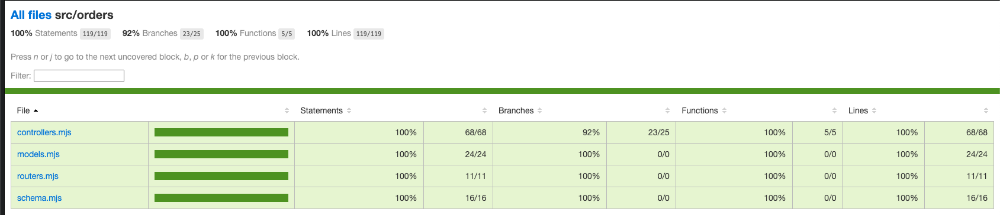

# node_express_mongo_orders_esm

Order API — CRUD REST services built with Express (ESM) and MongoDB (Mongoose).

## Project overview

`node_express_mongo_orders_esm` is a small REST API that implements CRUD operations for "orders" using modern ESM modules in Node.js. It uses:

- Node.js with ESM (`.mjs`) modules
- Express 5
- Mongoose for MongoDB schema and data access
- Joi for request validation
- Vitest + mongodb-memory-server + supertest for tests

Primary source files live under `src/`:

- `src/app.mjs` — application initialization (Express app)
- `src/server.mjs` — server bootstrap
- `src/db.mjs` — MongoDB connection logic
- `src/orders/` — domain: `controllers.mjs`, `routers.mjs`, `models.mjs`, `schema.mjs`

Tests are under `test/` and use an in-memory MongoDB (no external DB needed).

## Tech stack

- Node.js (ESM)
- Express 5
- MongoDB + Mongoose
- Joi for validation
- Vitest + mongodb-memory-server + supertest for testing

## Prerequisites

- Node.js >= 18 (recommended for native ESM support)
- npm (or yarn/pnpm)
- Optional: Docker & docker-compose if you want to run the app in containers

## Quick start (local)

1. Install dependencies:

```bash
npm install
```

2. Create a `.env` file at the project root (example below) or set environment variables in your shell.

Example `.env`:

```env
PORT=3000
MONGODB_URI=mongodb://localhost:27017/orders_db
NODE_ENV=development
```

3. Run in development (hot reload):

```bash
npm run start:dev
```

This runs `nodemon src/server.mjs` as defined in `package.json`.

The server will listen on the port defined in `PORT` (default `3000` if code provides a fallback).

## Running with Docker / docker-compose

This repository includes a `Dockerfile` and `docker-compose.yml`. To build and run with Docker:

```bash
docker-compose up --build
```

Adjust the `MONGODB_URI` or service definitions in `docker-compose.yml` as needed.

## Tests

This project uses `vitest` for unit/integration tests and `mongodb-memory-server` for an in-memory MongoDB during tests.

Run tests:

```bash
npm test
```

Run tests with coverage:

```bash
npm run coverage
```


Notes:
- Tests are in `test/` (for example `test/orders/controllers.test.mjs`, `test/orders/routers.test.mjs`).
- Because `mongodb-memory-server` is used, you do not need a running MongoDB instance for tests.

## Project structure (high level)

- `src/` — application source (ESM `.mjs` files)
  - `app.mjs` — express app config & middleware
  - `server.mjs` — starts the HTTP server
  - `db.mjs` — mongoose connection
  - `orders/` — controllers, routers, models, schema
- `test/` — test suite and test helpers
- `package.json` — scripts & deps
- `Dockerfile`, `docker-compose.yml` — containerization
- `coverage/` — generated coverage reports (after running coverage)

## Configuration / Environment variables

Common variables used by the app (add as appropriate to `.env`):
- `PORT` — port to run the app (default in code might be `3000`)
- `MONGODB_URI` — MongoDB connection string (e.g. `mongodb://localhost:27017/orders_db`)
- `NODE_ENV` — `development` / `test` / `production`

If you run tests with `NODE_ENV=test`, the test setup probably uses `mongodb-memory-server` automatically.

## How the API is organized

- Routers are defined in `src/orders/routers.mjs` and mounted to the Express app in `src/app.mjs`.
- Business logic sits in `src/orders/controllers.mjs`.
- Data models (Mongoose schemas) are in `src/orders/models.mjs`.
- Validation schemas (Joi) live in `src/orders/schema.mjs`.

Inspect these files for endpoint paths, request/response shapes, and validation rules.

## Troubleshooting

- "Cannot connect to MongoDB" — ensure `MONGODB_URI` is correct or start a local MongoDB instance, or run tests locally (they use memory server).
- Tests failing due to environment differences — run `npm test` which sets up the in-memory server; ensure no global DB assumptions in local dev environment.
- If you see ESM import errors, confirm Node version is >=18 and that the project is using `.mjs` files (this repo uses `.mjs`).

## Contribution

- Fork the repo, create a branch, add tests for new behavior, and submit a pull request.
- Keep changes small and focused; include test coverage for new functionality.

## License

This project is licensed under ISC (see `package.json`).

## Contact

Author: Shyam Vadikari (see `package.json` author field)

---

If you'd like, I can add an API reference section with endpoints, request/response examples, and curl snippets by reading the router and controller files — tell me to proceed and I'll add it to this README.
